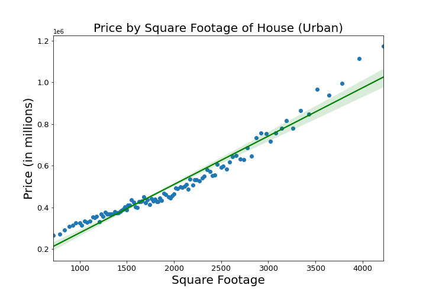
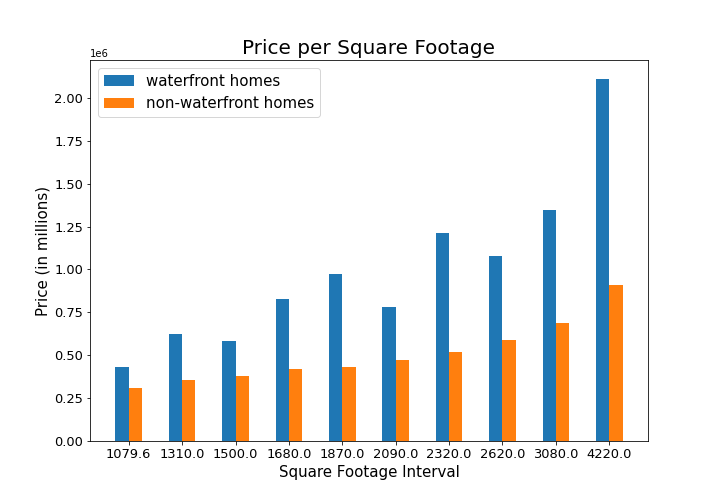

<<<<<<< HEAD

=======

>>>>>>> d338b34e38ed42c8148d9c5758cf59232858f583

# Statistical Inference of House Pricing in King County, Washington

---
**Authors**: Chandler O'Neal, Killian Kahalley, and Griffin Riner
---

## Overview

<<<<<<< HEAD
This project's focus was directed towards offering Empire Home Remodeling (EHR) insight into King County, Washington's housing market in terms of the most beneficial addition for remodeling homes. The project observed one table of housing information containing a total collection of 21,597 houses and 21 columns, these columns were then consolidated to two separate models based on the house locations within King County [rural and urban]. The model for urban King County focused on relating price to house square footage, grade (quality rating), waterfront (view of the water), and whether each house had a basement or not. The model for rural focused on relating price to house square footage, grade, whether each house had a basement or not. This analysis can be useful to provide Empire Home Remodeling with renovation proposals that would yield the most profitable returns.
=======
The focus of this project was to analyze the current film industry to offer Microsoft Corporation the best approach to compete with their competitors. The project observed 11 tables that contained information on the film industry including movie cost, rating, profit, and actor information. The tables were then consolidated to 4 tables; the four tables contained a total collection of 1,455 movies. This analysis can be useful to the Microsoft Corporation to determine the most profitable solution for allocating their funding had they decided to go into the film industry. 
>>>>>>> d338b34e38ed42c8148d9c5758cf59232858f583

---

## Business Problem

<<<<<<< HEAD
EHR may benefit from directing their funding, in urban King County, towards adding a basement, increasing house square footage, increasing grade, and obtain waterfront view if the view was previously obstructed. In rural King County, EHR may benefit from increasing house square footage, and improving grade.
=======
Microsoft Corporation may be able to focus their funding on hiring actors who have appeared in ten or more of the most profitable films in the industry to improve Microsoft's profitability and success rate. Microsoft may also be able to improve the profitability of their films by placing a minimum budget of 150 million dollars in order to produce higher quality films. 
>>>>>>> d338b34e38ed42c8148d9c5758cf59232858f583

---

## Data

<<<<<<< HEAD
The given table contained housing information which included the square footage of the property and home, latitude and longitude, waterfront view, basement or no basement, and other various other house attributes as number of floors and grade. 
=======
The 11 tables each contained a unique ID that was associated with the movie titles. These data sets contained information about actors, movie budget, gross returns, movie rating, and other film attributes.
>>>>>>> d338b34e38ed42c8148d9c5758cf59232858f583

---

## Methods

<<<<<<< HEAD
This project uses inferential analyses to identify the relationship between the data's variables (house information) and price. The inferential analyses used was the ordinary least squares linear regression model. 
=======
This project uses descriptive analyses, such as the measure of variability for budget and profitability as well as the tendency for actors in the most profitable films. This provides useful information on the impact of budget as well as actors who have taken part in the most profitable films. 
>>>>>>> d338b34e38ed42c8148d9c5758cf59232858f583

---

## Results

<<<<<<< HEAD
Visual of the districts sepparating rural from urban King County, Washington in our model


---

The urban squarefoot graph displays a comparison with price. This indicates a linear relationship, meaning that they are positively correlated to one another. 




---

In the urban grade graph, the houses were separated by their grade. The average price the houses sold were then plotted according to their grade.


---

This graph was separated into 10 groups of houses according to their overall square footage. We then took those 10 groups and determined which houses had waterfront property and which did not. Once that was determined we graphed the mean price of the houses in each group and compared the homes that did have waterfront property to the houses that did not have waterfront property. 




---

The rural squarefootage graph displays a comparison with price. This indicates a linear relationship, meaning that they are positively correlated to one another. 


---

Rural grade also has a linear relationship with price indicating that the price increases as a result of an increase in the grade of the house.


=======
Budgets above 150 million dollars have a stronger correlation with profit that those below 150 million. 


---

The 10 Actors that appeared in 10 or more of the most profitable films tended to be in a film with a mean profit above 30 million dollars.


---

The 20 most successful movies filtered by budget over 150 million dollars, tomatometer rating above 85, and profit above 300 million dollars had a consistent tomatometer status of Certified-Fresh.


---

The 10 actors with the highest average profit appeared in the most successful 80% of the time. 


>>>>>>> d338b34e38ed42c8148d9c5758cf59232858f583


---

## Conclusions

<<<<<<< HEAD
The project's analysis recommends a variety of potential home additions to increase the overall profitability of EHR's house renovations. 

---

For Urban King County:

* adding a basement

* increasing house square footage

* improving grade

* obtaining waterfront view if view was previously obstructed 

---

For Rural King County:

* increasing house square footage

* improving grade
=======

This analysis offers three recomendations to Microsoft Corporation to increase their success rate in film production.

* Produce a minimum budget for each film of least 150 million dollars and or ensure the best quality possible using budget. 

* Seek out actors who have been present in ten or more highly profitable films; the analysis provided that actors who have been present in such highly profitable films have offered a higher success rate for ongoing films.

>>>>>>> d338b34e38ed42c8148d9c5758cf59232858f583


---

## Next Steps

<<<<<<< HEAD
Further analysis could offer more in-depth predictions to:

* Further explore the ratio of bathrooms to bedrooms and their relationship to price  

* Inpect the interactions between the independent variables and the target variables(ex: how increasing square footage effects price given that it is a waterfront home and vice versa).
=======

Further analysis could offer more in-depth predictions to increase the likelihood of film success and profitablility

* Insight to suggested budget based off film length 

* A descriptive analysis of particularly undesired outcomes based on films that have failed in the industry.
>>>>>>> d338b34e38ed42c8148d9c5758cf59232858f583


---

## For More Information

<<<<<<< HEAD
Please review our full analysis in [our Jupyter Notebook](./renovation_analysis.ipynb) or our [presentation](./presentation_Analysis.pdf).

For any additional questions, please contact **Chandler O'Neal & jchandleroneal@gmail.com, Killian Kahalley & killian.kahalley@gmail.com, Griffin Riner & gnr400800@gmail.com**
=======

Please review our full analysis in [our Jupyter Notebook](./movie_analysis.ipynb) or our [presentation](./presentation_Analysis.pdf).

For any additional questions, please contact **Jordan Jones & jtjones1@bsc.edu, Chandler O'Neal & jchandleroneal@gmail.com**
>>>>>>> d338b34e38ed42c8148d9c5758cf59232858f583


---

## Repository Structure


```
<<<<<<< HEAD
├──data                     <- The tables used for this project 
├──images                   <- The images used 
├──notebooks                <- The table links used 
├──.canvas                  <- Flatiron Link
├──README.md                <- The README for project summary
├──.gitignore               <- The links of the tables used for this project 
└── presentation.pdf        <- PDF version of project presentation
=======
├──data/zippedData                     <- The tables used for this project 
├──images                              <- The images used 
├──src                                 <- The table links used 
├──.gitignore       
├──README.md                           <- The README for project summary
├──??.ipynb                     <- The links of the tables used for this project 
├──??.ipynb                <- Narrative documentation of analysis in Jupyter notebook
└── ?presentation?.pdf           <- PDF version of project presentation
>>>>>>> d338b34e38ed42c8148d9c5758cf59232858f583
```
