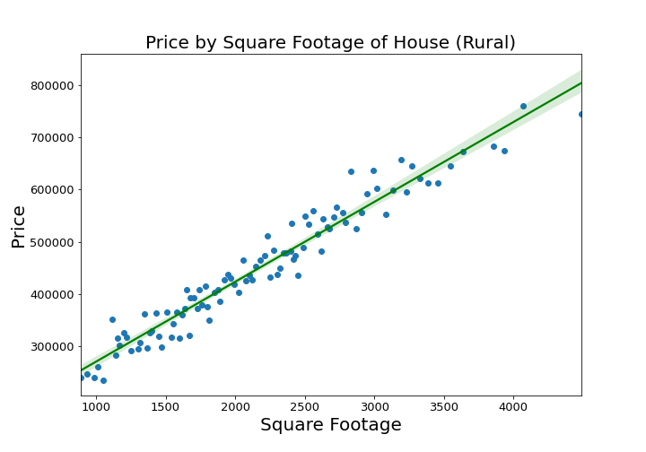
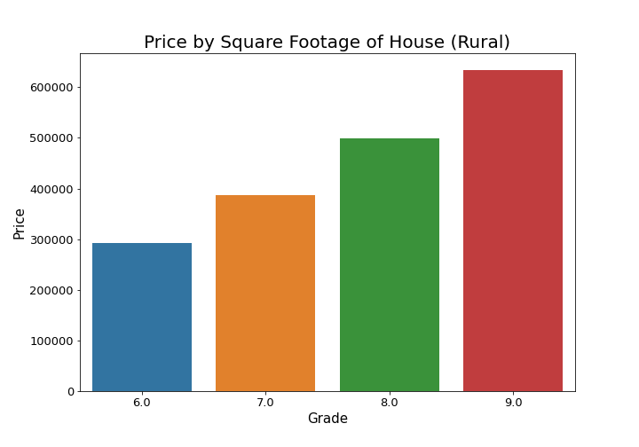

<<<<<<< HEAD


# Statistical Inference of House Pricing in King County, Washington

---
**Authors**: Chandler O'Neal, Killian Kahalley, and Griffin Riner
---

## Overview

This project's focus was directed towards offering Empire Home Remodeling (EHR) insight into King County, Washington's housing market in terms of the most beneficial addition for remodeling homes. The project observed one table of housing information containing a total collection of 21,597 houses and 21 columns, these columns were then consolidated to two separate models based on the house locations within King County [rural and urban]. The model for urban King County focused on relating price to house square footage, grade (quality rating), waterfront (view of the water), and whether each house had a basement or not. The model for rural focused on relating price to house square footage, grade, whether each house had a basement or not. This analysis can be useful to provide Empire Home Remodeling with renovation proposals that would yield the most profitable returns.

---

## Business Problem

EHR may benefit from directing their funding, in urban King County, towards adding a basement, increasing house square footage, increasing grade, and obtain waterfront view if the view was previously obstructed. In rural King County, EHR may benefit from increasing house square footage, and improving grade.

---

## Data

The given table contained housing information which included the square footage of the property and home, latitude and longitude, waterfront view, basement or no basement, and other various other house attributes as number of floors and grade. 

---

## Methods

This project uses inferential analyses to identify the relationship between the data's variables (house information) and price. The inferential analyses used was the ordinary least squares linear regression model. 

---

## Results

Districts


---

Urban squarefoot


---

Urban grade


---

Urban waterfront


---

Rural square footage




---

Rural grade




---

## Conclusions

The project's analysis recommends a variety of potential home additions to increase the overall profitability of EHR's house renovations. 

---

For Urban King County:

* adding a basement

* increasing house square footage

* improving grade

* obtaining waterfront view if view was previously obstructed 

---

For Rural King County:

* increasing house square footage

* improving grade


---

## Next Steps

Further analysis could offer more in-depth predictions to:

* Further explore the ratio of bathrooms to bedrooms and their relationship to price  

* Inpect the interactions between the independent variables and the target variables(ex: how increasing square footage effects price given that it is a waterfront home and vice versa).


---

## For More Information

Please review our full analysis in [our Jupyter Notebook](./movie_analysis.ipynb) or our [presentation](./presentation_Analysis.pdf).

For any additional questions, please contact **Chandler O'Neal & jchandleroneal@gmail.com, Killian Kahalley & killian.kahalley@gmail.com, Griffin Riner & gnr400800@gmail.com**


---

## Repository Structure


```
├──data                     <- The tables used for this project 
├──images                   <- The images used 
├──notebooks                <- The table links used 
├──.canvas                  <- Flatiron Link
├──README.md                <- The README for project summary
├──.gitignore               <- The links of the tables used for this project 
└── ?presentation?.pdf      <- PDF version of project presentation
```
=======
>>>>>>> chandler_oneal
